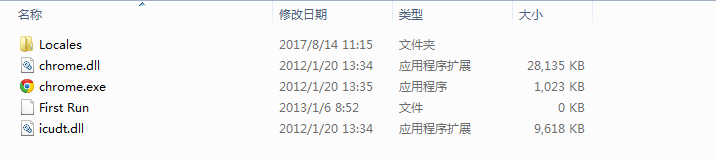
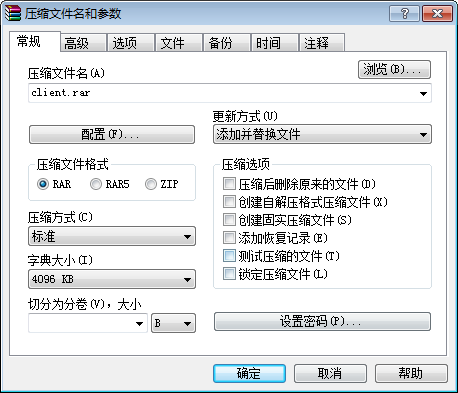

# 精简版浏览器
[1  概述](#user-content-1--概述)

[2  判断浏览器是否支持HTML5](#user-content-2--判断浏览器是否支持HTML5)

[3  制作精简版chrome](#user-content-3--制作精简版chrome)

##  1  概述

部分客户还在使用IE7、IE8，或者以IE8为内核的360浏览器，这些浏览器不支持HTML5，我们把这些浏览器称为“老式浏览器”；相反的，凡是支持HTML5的浏览器，称之为“现代浏览器”。

在开发工作中，需要投入大量的成本对老式浏览器进行兼容适配；大部分优秀的HTML5效果，例如canvas绘图、音频视频、css3样式等，在老式浏览器中难以实现；而且目前主流的前端框架，如react、vue等，也不被支持。

为提高开发效率，提升网页效果，我们使用精简版chrome浏览器来解决这一问题。

精简版chrome是一种体积很小的绿色版chrome，大小只有14M左右，包括了chrome浏览器的核心功能。

在系统首页，通过js对浏览器版本进行检测，当版本过低时弹出提示，要求用户使用现代浏览器打开系统，或者下载我们提供的chrome精简版。


##  2  判断浏览器是否支持HTML5

我们需要在系统首页加载前，判断浏览器是否为现代浏览器。

可通过以下代码判断：

```javascript
if (!document.createElement('canvas').getContext) { 
    alert('您的浏览器不被支持');
}
```

canvas是HTML5新增的一个重要标签，上面的语句判断浏览器是否支持canvas，因此可判断浏览器是否支持HTML5.


##  3  制作精简版chrome

1、下载chrome精简版，解压，打开app/Chrome-bin目录，内容如下：



2、使用rar软件，对全部文件打包压缩，如下图（本文采用的是winrar 5.30版本）



3、勾选“创建自解压格式压缩文件”，如图


4、打开“高级”选项卡，再打开“自解压选项...”，如图


5、弹出了“高级自解压选项”窗口，如下图


6、切换到“设置”选项卡，并在“提取后运行”栏目中输入以下代码

```shell
chrome.exe --app=http://www.baidu.com
```

如下图所示：


7、切换到“模式”选项卡，勾选“解包到临时文件夹”，在下方选择“全部隐藏”


8、点击确定按钮，开始压缩。获得的文件如下：


双击运行，可直接打开之前配置的网址（http://www.baidu.com)


